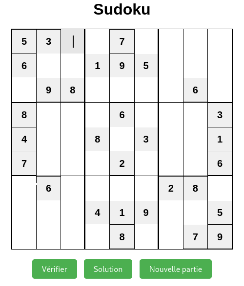
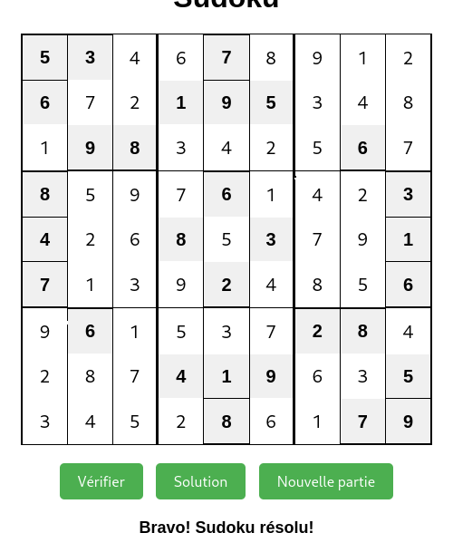

# 🧩 Sudoku Game

A fully functional Sudoku puzzle game built with vanilla JavaScript, HTML, and CSS. Play classic Sudoku with intuitive controls and helpful features.

 <!-- Replace with your actual screenshot -->




## 🌟  Features

- **Solution finder**: Provides the solution of a sudoku board
- **Solution checker**: That help to find if your are right or you made a mistake
- **Print Mode**: Generate printable puzzles

## 🚀 How to Play

1. Clone this repository or download the ZIP file
2. Open `index.html` in your browser
3. Fill the grid so each row, column, and 3×3 box contains digits 1-9 without repetition
5. Then verify your solution by clicking on the button " Verifier "

## 🛠️ Technologies Used

- **Frontend**: JavaScript 
- **Styling**: Pure CSS 
- **Puzzle Generation**: Custom backtracking algorithm


## 📂 Project Structure

```
sudoku/
├── index.html          # Main HTML file
├── style.css           # All styling
├── script.js           # Core game logic
├── sudoku.png
│── solution.png
└── README.md           # This file
```


## 🔧 Installation

No installation required! Just open `index.html` in any modern browser.

For development:
```bash
git clone https://github.com/david15tonon/sudoku.git
cd sudoku
```

## 🤝 Contributing

Contributions are welcome! Please open an issue first to discuss what you'd like to change.

## 📜 License

MIT © [David TONON]

